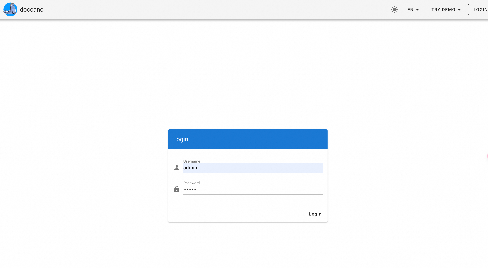

# Quick Deployment Instructions for Doccano

## Service Description

Doccano is an open-source text annotation tool for humans. 
It provides annotation features for text classification, sequence labeling, and sequence to sequence tasks. 
You can create labeled data for sentiment analysis, named entity recognition, text summarization, and so on. 
Just create a project, upload data, and start annotating. You can build a dataset in hours.
Official Doccano Github repo: [https://github.com/doccano/doccano](https://github.com/doccano/doccano).

## Service Architecture

The deployment architecture of the service constructed by this service template is a single ECS deployment.  

## Billing Description

When users deploy the constructed service, resource fees mainly involve:

- Selected ECS instance specifications
- Disk capacity
- Public network bandwidth

Billing methods include:

- Pay-as-you-go (hourly)
- Subscription (yearly/monthly)

Estimated costs can be seen in real-time before deployment.

## Required RAM Account Permissions

This service template requires access and creation operations on ECS, VPC, and other resources. If using a RAM user to
create a service instance, ensure to add the required resource permissions to the RAM user account beforehand. For
detailed operations on adding RAM permissions, please refer
to [Authorize RAM User](https://help.aliyun.com/document_detail/121945.html). Required permissions are shown in the
table below:

| Permission Policy Name              | Description                                                |
|-------------------------------------|------------------------------------------------------------|
| AliyunECSFullAccess                 | Permissions to manage Elastic Compute Service (ECS)        |
| AliyunVPCFullAccess                 | Permissions to manage Virtual Private Cloud (VPC)          |
| AliyunROSFullAccess                 | Permissions to manage Resource Orchestration Service (ROS) |
| AliyunComputeNestUserFullAccess     | User-side permissions for ComputeNest Service              |
| AliyunComputeNestSupplierFullAccess | Supplier-side permissions for ComputeNest Service          |

## Service Instance Deployment Process

### Deployment Parameter Description

| Parameter Group            | Parameter Item    | Description                                                                                                                                                              |
|----------------------------|-------------------|--------------------------------------------------------------------------------------------------------------------------------------------------------------------------|
| Service Instance           | Instance Name     | Must not exceed 64 characters, start with a letter, and can include numbers, letters, hyphens (-), and underscores (_).                                                  |
|                            | Region            | The region where the service instance is deployed.                                                                                                                       |
|                            | Payment Type      | Resource billing type: Pay-as-you-go or Subscription.                                                                                                                    |
| ECS Instance Configuration | Instance Type     | ECS instance specification configuration.                                                                                                                                |
|                            | Instance Password | Length between 8-30 characters, must include at least three of the following: uppercase letters, lowercase letters, numbers, and special characters from ()`~!@#$%^&*-+= |{}[]:;'<>,.?/. |
| Network Configuration      | Availability Zone | The availability zone where the ECS instance is located.                                                                                                                 |

### Deployment Steps

1. Click [Deployment Link](https://computenest.console.aliyun.com/service/instance/create/default?type=user&ServiceName=NocoBase%20%E7%A4%BE%E5%8C%BA%E7%89%88) to enter the service instance deployment page.

2. Select "Create a New ECS Instance" and configure parameters as prompted. After configuration, click "Next: Confirm Order."  
   

3. Click "Create Now" and wait for the service instance to complete creation.  
   

4. Once the service instance is successfully created, go to the service instance details page. 
   

5. Click the nginx address to access the Doccano service.  
   
   

