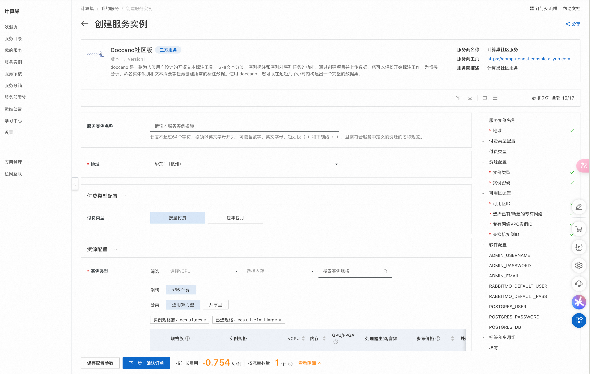
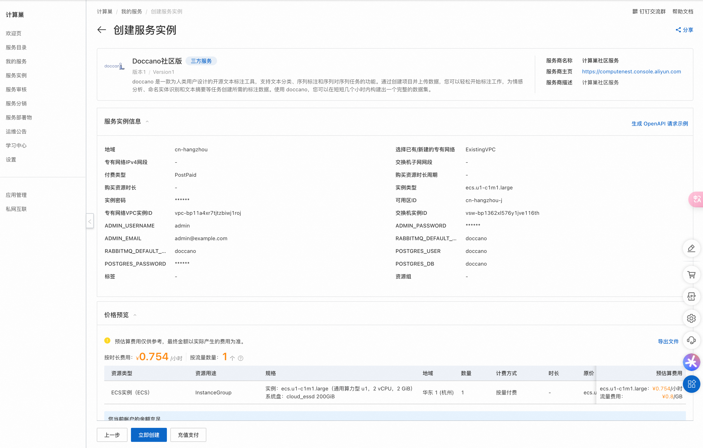
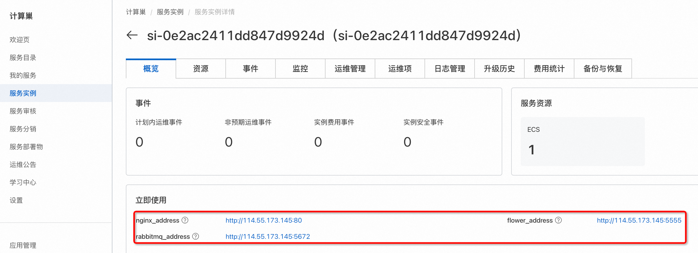
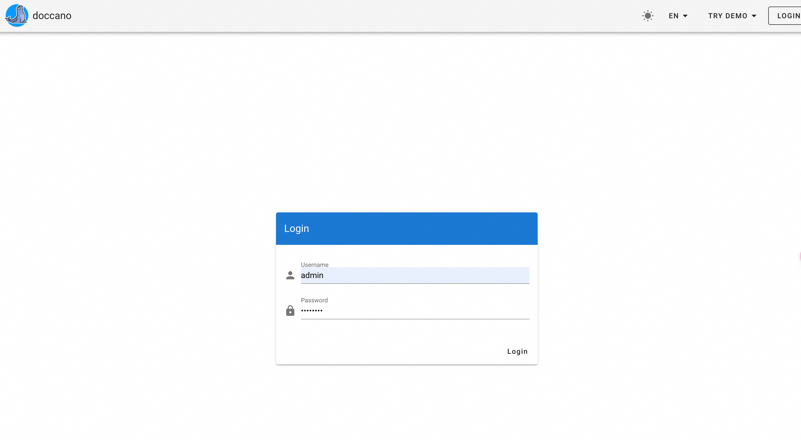

# 快速部署Doccano说明文档

## 服务说明

Doccano 是一款为人类用户设计的开源文本标注工具，支持文本分类、序列标注和序列对序列任务的功能。
通过创建项目并上传数据，您可以轻松开始标注工作，为情感分析、命名实体识别和文本摘要等任务创建所需的标注数据。
使用 doccano，您可以在短短几个小时内构建出一个完整的数据集。
Doccano官方仓库：[https://github.com/doccano/doccano](https://github.com/doccano/doccano)，
Doccano官方文档：[https://doccano.github.io/doccano/](https://doccano.github.io/doccano/)。

## 服务架构

此服务模板构建出的服务的部署架构为单机ecs部署。

## 计费说明

用户部署构建出的服务时，资源费用主要涉及：

- 所选ECS实例规格
- 磁盘容量
- 公网带宽

计费方式包括：

- 按量付费（小时）
- 包年包月

预估费用在部署前可实时看到。

## RAM账号所需权限

此服务模板构建出的服务需要对ECS、VPC等资源进行访问和创建操作，若使用RAM用户创建服务实例，需要在创建服务实例前，对使用的RAM用户的账号添加相应资源的权限。添加RAM权限的详细操作，请参见[为RAM用户授权](https://help.aliyun.com/document_detail/121945.html)
。所需权限如下表所示：

| 权限策略名称                              | 备注                            |
|-------------------------------------|-------------------------------|
| AliyunECSFullAccess                 | 管理云服务器服务（ECS）的权限              |
| AliyunVPCFullAccess                 | 管理专有网络（VPC）的权限                |
| AliyunROSFullAccess                 | 管理资源编排服务（ROS）的权限              |
| AliyunComputeNestUserFullAccess     | 管理计算巢服务（ComputeNest）的用户侧权限    |
| AliyunComputeNestSupplierFullAccess | 管理计算巢服务（ComputeNest）的服务商侧权限 ｜ |

## 服务实例部署流程

### 部署参数说明

| 参数组     | 参数项    | 说明                                                                      |
|---------|--------|-------------------------------------------------------------------------|
| 服务实例    | 服务实例名称 | 长度不超过64个字符，必须以英文字母开头，可包含数字、英文字母、短划线（-）和下划线（_）。                          |
|         | 地域     | 服务实例部署的地域。                                                              |
|         | 付费类型   | 资源的计费类型：按量付费和包年包月。                                                      |
| ECS实例配置 | 实例类型   | ECS实例规格配置。                                                              |
|         | 实例密码   | 长度8-30，必须包含三项（大写字母、小写字母、数字、 ()`~!@#$%^&*-+=&#124;{}[]:;'<>,.?/ 中的特殊符号）。 |
| 网络配置    | 可用区    | ECS实例所在可用区。                                                             |

### 部署步骤

1. 单击[部署链接](https://computenest.console.aliyun.com/service/instance/create/default?type=user&ServiceName=Doccano社区版)
，进入服务实例部署界面。

2. 选择新建ECS实例并根据界面提示配置参数，配置完成后点击下一步：确认订单。  
   

3. 点击立即创建，等待服务实例创建完成。  
   

4. 服务实例创建成功后，进入服务实例详情页。在概览页可获取Doccano登录信息。  
   

5. 点击外网面板地址访问Doccano服务。  
     
   
